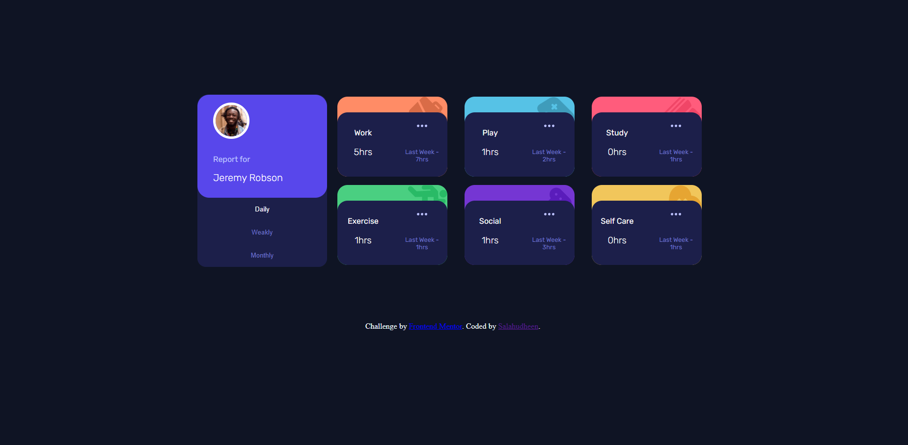
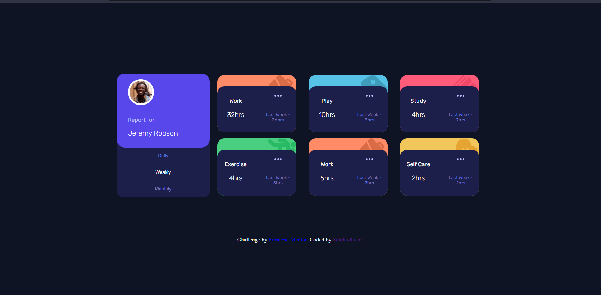
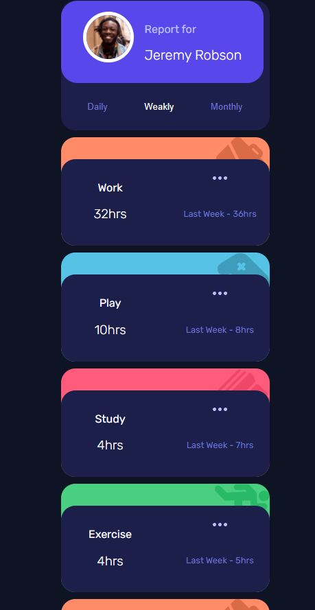

# Frontend Mentor - Time tracking dashboard solution

This is a solution to the [Time tracking dashboard challenge on Frontend Mentor](https://www.frontendmentor.io/challenges/time-tracking-dashboard-UIQ7167Jw). Frontend Mentor challenges help you improve your coding skills by building realistic projects. 

## Table of contents

- [Overview](#overview)
  - [The challenge](#the-challenge)
  - [Screenshot](#screenshot)
  - [Links](#links)
- [My process](#my-process)
  - [Built with](#built-with)
  - [Useful resources](#useful-resources)
- [Author](#author)
- [Acknowledgments](#acknowledgments)

**Note: Delete this note and update the table of contents based on what sections you keep.**

## Overview

### The challenge

Users should be able to:

- View the optimal layout for the site depending on their device's screen size
- See hover states for all interactive elements on the page
- Switch between viewing Daily, Weekly, and Monthly stats

### Screenshot

### Links

- Solution URL: [gitHub](https://github.com/salahudheen007/time-tracking)
- Live Site URL: [time-tracking]( https://salahudheen007.github.io/time-tracking/)

## My process

### Built with

- Semantic HTML5 markup
- CSS custom properties
- Flexbox
- CSS Grid
- Mobile-first workflow
- [VueJS](https://vuejs.org/) - JS library

sa

### Useful resources

- [vueJS documentation](https://v3.vuejs.org/guide/introduction.html) 
- [w3school](https://www.w3schools.com/) - for HTML and CSS

## Author

- Frontend Mentor - [@salahudheen007](https://www.frontendmentor.io/profile/salahudheen007)
- GitHub - [@salahudheen007](https://github.com/salahudheen007)
- HackerRank - [@salahukutipurav1](https://www.hackerrank.com/salahukutipurav1)

## Acknowledgments

This is where you can give a hat tip to anyone who helped you out on this project. Perhaps you worked in a team or got some inspiration from someone else's solution. This is the perfect place to give them some credit.

